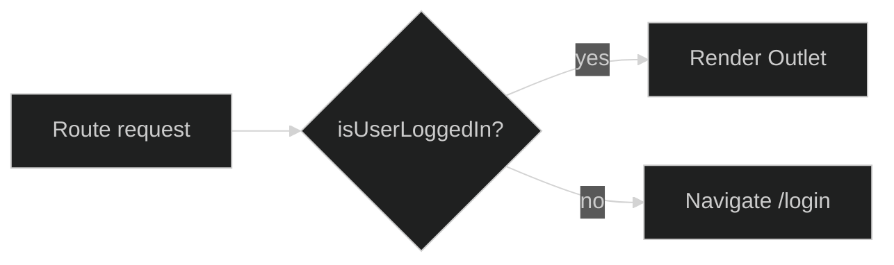

<div align="center">


<a href="https://git.io/typing-svg">
  
</a>

<br/>

### ⟡ Live telemetry ⟡

[](https://github.com/AbdulWajid768/react_boilerplate/stargazers)
[](https://github.com/AbdulWajid768/react_boilerplate/network/members)
[](https://github.com/AbdulWajid768/react_boilerplate/watchers)
[](https://github.com/AbdulWajid768/react_boilerplate/issues)

[](https://github.com/AbdulWajid768/react_boilerplate/commits/main)
[](https://github.com/AbdulWajid768/react_boilerplate/graphs/commit-activity)
[](https://github.com/AbdulWajid768/react_boilerplate)

[](https://react.dev/)
[](https://redux-toolkit.js.org/)
[](https://nodejs.org/)

<br/>


<br/><br/>

[🧬 Prerequisites](#-prerequisites) · [▶ Run](#-run) · [🗂 Structure](#-structure)


</div>

---

## ◈ Transmission

Skip the **scaffolding tax**. This is **Create React App 18** with a product-grade layout: Axios API layer, Redux store, auth-gated routes, Formik + Yup, Bootstrap + Sass tokens, Google OAuth slot, and toast UX—ready for your domain logic on day one.

```text
  Browser
     │
     ▼
  React Router v6 ──► RequireAuth ──► Layout / Pages
     │                      │
     ▼                      ▼
  Redux Toolkit          api/endpoints.js
     │                      │
     └────────── Axios ─────┘
```

---

## ◈ Prerequisites

| Tool | Version |
| --- | --- |
| **Node.js** | **v21** |
| **Yarn** | 1.x or 3.x |

---

## ◈ Run

```bash
git clone https://github.com/AbdulWajid768/react_boilerplate.git
cd react_boilerplate

yarn install
yarn start      # http://localhost:3000
yarn build
yarn test
```

---

## ◈ Structure

```text
src/
├── api/              endpoints · calls · helpers
├── common/           routes · hooks · Yup schemas
├── components/       Layout shell
├── pages/            route views
├── reduxStore/       store + rootReducer
├── scss/             _colors · _mixins · variables
├── App.js            Router + RequireAuth + toasts
└── sample.config.js  → copy for env config
```

**Bundled:** `react-router-dom` · `@reduxjs/toolkit` · `formik` + `yup` · `axios` · `bootstrap` / `react-bootstrap` · `sass` · `@react-oauth/google` · `react-toastify`

---

## ◈ Auth gate



---

<div align="center">

<a href="https://star-history.com/#AbdulWajid768/react_boilerplate&Date">
  <picture>
    <source media="(prefers-color-scheme: dark)" srcset="https://api.star-history.com/svg?repos=AbdulWajid768/react_boilerplate&type=Date&theme=dark"/>
    
  </picture>
</a>

<br/>


<br/><br/>

**[Abdul Wajid](https://github.com/AbdulWajid768)** · Software Engineer · Lahore, PK

[](https://github.com/AbdulWajid768)
[](https://www.linkedin.com/in/abdul-wajid-amin/)


<sub>Boot the UI · Iterate at lightspeed.</sub>

</div>
